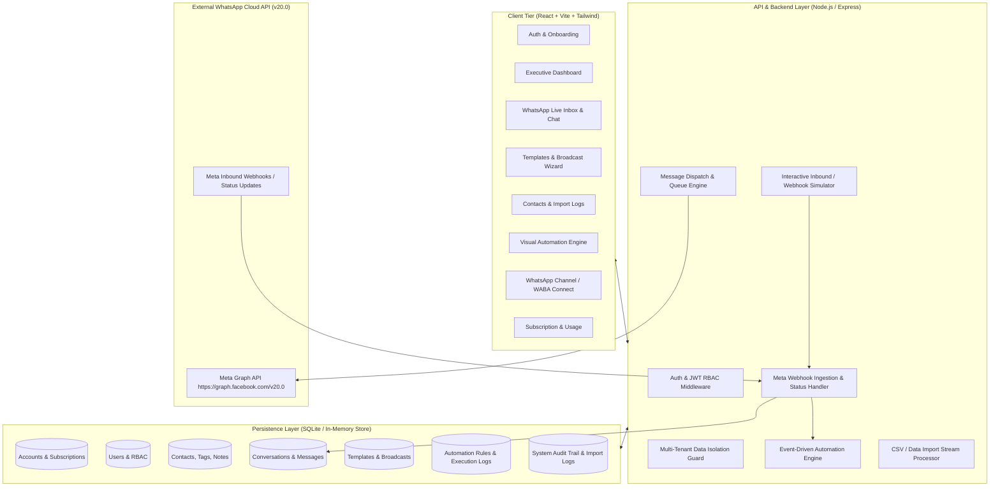
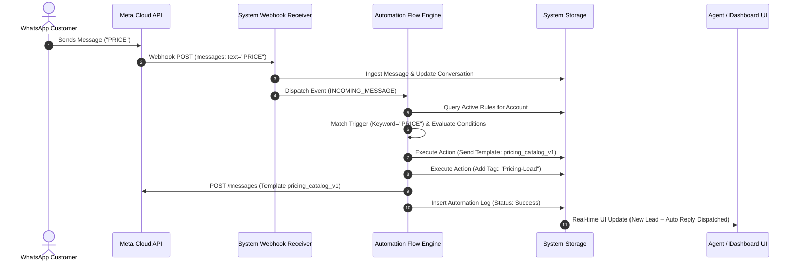

# Sheetbotics WhatsApp Management — SYSTEM BRAIN & ARCHITECTURAL MASTER BLUEPRINT

> **Version:** 1.0.0-PROD  
> **Classification:** Living System Architecture & Reference Brain  
> **Platform:** Sheetbotics WhatsApp Management (Enterprise SaaS)  
> **Last Updated:** 2026-09-27  

---

## 1. Executive Overview & System Purpose

**Sheetbotics WhatsApp Management** is a multi-tenant enterprise SaaS platform enabling businesses to manage end-to-end WhatsApp communications, customer relationships, marketing broadcasts, and intelligent workflow automations through the official Meta WhatsApp Cloud API.

### Core Value Pillars
1. **Centralized Omnichannel WhatsApp Hub**: Unified team inbox with live statuses (Sent, Delivered, Read, Failed) and agent routing.
2. **Compliant Template & Campaign Engine**: Meta-approved template builder with dynamic variable interpolation and high-throughput scheduled broadcasting.
3. **Smart Automation Flow Engine**: Event-driven rules triggering personalized messaging, contact tagging, and agent assignment.
4. **Resilient Multi-Tenant Architecture**: Strict data isolation per account, enterprise RBAC (Owner, Admin, Manager, Agent), and complete audit logging.

---

## 2. High-Level System Architecture



---

## 3. Multi-Tenant Data Models & Schema Blueprint

Every operational table is partitioned by `accountId` to guarantee strict multi-tenant boundary isolation.

### 3.1 Account & User Entities
```typescript
interface Account {
  id: string;                    // UUID
  businessName: string;          // e.g. "Acme Retailers Pvt Ltd"
  plan: 'starter' | 'growth' | 'enterprise';
  status: 'active' | 'suspended' | 'trial';
  createdAt: string;
  monthlyMessageLimit: number;
  messagesUsedThisMonth: number;
  contactLimit: number;
}

interface User {
  id: string;
  accountId: string;
  fullName: string;
  email: string;
  mobileNumber: string;
  role: 'owner' | 'admin' | 'manager' | 'agent';
  status: 'active' | 'inactive';
  avatarUrl?: string;
  createdAt: string;
  lastLoginAt?: string;
}
```

### 3.2 WhatsApp Channel (WABA) Entity
```typescript
interface WhatsAppChannel {
  id: string;
  accountId: string;
  channelName: string;           // e.g. "Primary Support Line"
  whatsappNumber: string;        // e.g. "+919876543210"
  wabaId: string;                // Meta WhatsApp Business Account ID
  phoneNumberId: string;         // Meta Phone Number ID
  appId?: string;
  accessToken?: string;          // Permanent System User Access Token
  webhookVerifyToken: string;
  connectionStatus: 'connected' | 'disconnected' | 'pending' | 'verification_required';
  qualityRating: 'GREEN' | 'YELLOW' | 'RED' | 'UNKNOWN';
  messagingTier: 'TIER_1K' | 'TIER_10K' | 'TIER_100K' | 'UNLIMITED';
  createdAt: string;
  updatedAt: string;
}
```

### 3.3 Contact & Tag Entities
```typescript
interface Contact {
  id: string;
  accountId: string;
  name: string;
  mobileNumber: string;          // E.164 formatted (+91...)
  email?: string;
  company?: string;
  tags: string[];                // e.g. ["VIP", "Lead", "DiwaliPromo"]
  source: 'manual' | 'import' | 'webhook' | 'chat' | 'campaign';
  optInStatus: 'opted_in' | 'opted_out' | 'pending';
  status: 'active' | 'archived' | 'blocked';
  customAttributes: Record<string, string>;
  lastContactedAt?: string;
  createdAt: string;
  notes?: string;
}
```

### 3.4 Conversation & Message Lifecycle Entities
```typescript
type MessageStatus = 'queued' | 'sending' | 'sent' | 'delivered' | 'read' | 'failed';

interface Conversation {
  id: string;
  accountId: string;
  contactId: string;
  contactName: string;
  contactPhone: string;
  channelId: string;
  assignedToUserId?: string;
  assignedToName?: string;
  status: 'open' | 'pending' | 'resolved' | 'closed';
  lastMessageText: string;
  lastMessageTimestamp: string;
  unreadCount: number;
  tags: string[];
}

interface Message {
  id: string;
  accountId: string;
  conversationId: string;
  contactId: string;
  direction: 'inbound' | 'outbound';
  type: 'text' | 'template' | 'image' | 'document' | 'interactive';
  text?: string;
  mediaUrl?: string;
  templateName?: string;
  templateParams?: Record<string, string>;
  status: MessageStatus;
  metaMessageId?: string;
  errorCode?: string;
  errorMessage?: string;
  timestamp: string;
  senderName?: string;
}
```

### 3.5 Message Templates & Broadcast Entities
```typescript
interface TemplateComponent {
  type: 'HEADER' | 'BODY' | 'FOOTER' | 'BUTTONS';
  format?: 'TEXT' | 'IMAGE' | 'DOCUMENT';
  text?: string;
  buttons?: Array<{
    type: 'QUICK_REPLY' | 'URL' | 'PHONE_NUMBER';
    text: string;
    url?: string;
    phoneNumber?: string;
  }>;
}

interface MessageTemplate {
  id: string;
  accountId: string;
  name: string;                  // e.g. "order_confirmation_v1"
  category: 'MARKETING' | 'UTILITY' | 'AUTHENTICATION';
  language: string;              // e.g. "en_US", "hi"
  components: TemplateComponent[];
  variables: string[];           // e.g. ["name", "order_id", "delivery_date"]
  status: 'DRAFT' | 'PENDING' | 'APPROVED' | 'REJECTED' | 'PAUSED';
  createdAt: string;
  updatedAt: string;
}

interface BroadcastCampaign {
  id: string;
  accountId: string;
  name: string;
  templateId: string;
  templateName: string;
  channelId: string;
  targetAudienceType: 'all' | 'tag_filter' | 'custom_list';
  targetTags: string[];
  variableMappings: Record<string, string>; // e.g. { "1": "name", "2": "company" }
  totalRecipients: number;
  sentCount: number;
  deliveredCount: number;
  readCount: number;
  failedCount: number;
  status: 'draft' | 'scheduled' | 'processing' | 'running' | 'completed' | 'paused' | 'failed';
  scheduledAt?: string;
  createdAt: string;
  completedAt?: string;
}
```

### 3.6 Automation Rules & Execution Logs
```typescript
interface AutomationRule {
  id: string;
  accountId: string;
  name: string;
  trigger: {
    type: 'new_contact' | 'tag_added' | 'incoming_message_keyword' | 'contact_updated';
    keywordPattern?: string;     // e.g. "PRICE|INFO|OFFER"
    targetTag?: string;
  };
  conditions: Array<{
    field: string;               // e.g. "optInStatus" | "tags"
    operator: 'equals' | 'contains' | 'not_equals';
    value: string;
  }>;
  actions: Array<{
    type: 'send_template' | 'add_tag' | 'remove_tag' | 'assign_agent' | 'send_quick_text';
    templateId?: string;
    tag?: string;
    agentId?: string;
    messageText?: string;
  }>;
  status: 'active' | 'paused' | 'draft';
  executionCount: number;
  createdAt: string;
}

interface AutomationLog {
  id: string;
  accountId: string;
  ruleId: string;
  ruleName: string;
  contactId: string;
  contactName: string;
  triggerEvent: string;
  status: 'success' | 'failed' | 'skipped';
  details: string;
  executedAt: string;
}
```

---

## 4. Meta WhatsApp Cloud API v20.0 Engine Spec

### 4.1 Outbound Template Message Dispatch
When dispatching a message through Meta Graph API:
- **Endpoint:** `POST https://graph.facebook.com/v20.0/{PHONE_NUMBER_ID}/messages`
- **Headers:** `Authorization: Bearer {ACCESS_TOKEN}`, `Content-Type: application/json`
- **Payload Example:**
```json
{
  "messaging_product": "whatsapp",
  "recipient_type": "individual",
  "to": "+919876543210",
  "type": "template",
  "template": {
    "name": "seasonal_offer_v1",
    "language": { "code": "en_US" },
    "components": [
      {
        "type": "body",
        "parameters": [
          { "type": "text", "text": "Rahul Sharma" },
          { "type": "text", "text": "DIWALI50" }
        ]
      }
    ]
  }
}
```

### 4.2 Inbound Webhook Payload Ingestion
Meta dispatches updates to `/api/whatsapp/webhook`:
1. **Verification (GET):** Validates `hub.mode === 'subscribe'` and `hub.verify_token === channel.webhookVerifyToken` returning `hub.challenge`.
2. **Event Processing (POST):**
   - **Status Events (`statuses`):** Updates message from `sent` -> `delivered` -> `read` (or `failed` with Meta error code 131051, 131047, etc.).
   - **Incoming Messages (`messages`):** Ingests incoming text/media/button replies, links to contact conversation, and fires the **Automation Engine**.

---

## 5. Automation & Event Execution Engine Lifecycle



---

## 6. Frontend Hierarchy & Module Matrix

| Route / Module | Key Functions & Components |
|---|---|
| **`/login` & `/signup`** | Tenant registration, credential validation, demo instant-switch accounts. |
| **`/dashboard`** | 9 KPI metric cards, interactive delivery funnel chart, hourly/daily activity bar graphs, active campaigns widget, recent event stream. |
| **`/inbox` & `/inbox/:id`** | WhatsApp two-pane chat interface, search/filter drawer, rich message bubble view with real-time status checkmarks, quick replies, emoji picker, and **Live Inbound Simulator tool**. |
| **`/campaigns/templates`** | Meta template builder with dynamic `{{1}}` placeholders, category selector, button action configurator, and real-time smartphone preview. |
| **`/campaigns/broadcast`** | 5-step broadcast wizard: name & channel -> audience selector -> template & variable mapping -> live preview -> instant/scheduled dispatch with progress monitor. |
| **`/contacts`** | Full CRUD contact directory, multi-tag filters, opt-in toggle, single & batch actions, CSV export. |
| **`/contacts/import` & `/import-logs`** | Drag-and-drop CSV parser, column mapper, real-time validation (duplicates & invalid numbers), and historical audit logs with error inspector. |
| **`/automations`** | Interactive visual automation builder with trigger/condition/action cards, toggle active/pause, and execution history ledger. |
| **`/channel`** | WABA configuration, health checker, Meta credentials tester, QR code connect simulation, webhook URL & token generator. |
| **`/settings`** | Team RBAC user management, profile settings, security policies, API credentials. |
| **`/pay`** | Subscription tiers, conversation cost calculator, quota meters, billing invoice history. |

---

## 7. Role-Based Access Control (RBAC) Matrix

| Module / Action | Super Admin | Owner | Admin | Manager | Agent |
|---|:---:|:---:|:---:|:---:|:---:|
| **Super Admin Portal** | Full | None | None | None | None |
| **All Customer Tenants** | Full (Manage/Impersonate) | Own Only | Own Only | Own Only | Own Only |
| **Platform Meta API Config** | Full | None | None | None | None |
| **Quota & Plan Adjustments** | Full | View Only | View Only | None | None |
| **Dashboard** | Full | Full | Full | Full | Full |
| **Inbox & Chat** | Full | Full | Full | Full | Assigned Only / Full |
| **Campaigns & Broadcast** | Full | Full | Full | Full | Read Only |
| **Message Templates** | Full | Full | Full | Full | Read Only |
| **Contact Directory** | Full | Full | Full | Full | View & Add |
| **Automations** | Full | Full | Full | Full | None |
| **Channel Settings** | Full | Full | Full | View Only | None |
| **Billing & Payments** | Full | Full | Full | None | None |
| **Team / Users** | Full | Full | Full | None | None |

---

## 8. Built-in Interactive Inbound Simulator

To enable complete local and end-to-end testing without waiting for live Meta Cloud approval:
- Built-in **Webhook & Inbound Message Simulator** lets developers and testers simulate customer incoming messages, button clicks, and read receipts.
- Triggers active automations immediately.
- Updates chat conversations in real time.
- Emulates Meta Cloud API status delivery callbacks (`sent` -> `delivered` -> `read`).

---

## 9. Super Admin Architecture & Multi-Tenant Management

1. **Root Platform Isolation**:
   - `usr_superadmin` / `acc_platform_admin` operate at the root hypervisor tier.
   - Credentials: `admin@sheetbotics.com` / `admin123`.
2. **Customer Organization Lifecycle**:
   - Superadmin can create enterprise accounts manually with customized message and contact limits.
   - Can dynamically adjust monthly WhatsApp conversation limits and upgrade/downgrade subscription tiers.
   - Can suspend and reactivate customer accounts instantaneously.
3. **Workspace Impersonation Engine**:
   - Allows Superadmin to log in as any customer business to configure WABA numbers, review templates, or debug issues on their behalf.
   - Topbar highlights impersonation state with an instant 1-click `[Exit Impersonation]` button.
4. **Backend Webhook & Meta API Node.js Gateway**:
   - Port 5000 Express Server (`server/index.js`) listening on `/webhook/whatsapp`.
   - Handles official Meta challenge verification (`hub.mode === 'subscribe' && hub.verify_token === token`).
   - Ingests inbound message payloads and emits delivery receipts.
   - Proxied via Vite (`http://localhost:3000/webhook/whatsapp` and `/api/*`).

---

## 10. Developer Guidelines & Golden Rules

1. **Multi-Tenancy:** Always scope database queries with `accountId`.
2. **E.164 Phone Formatting:** All WhatsApp phone numbers must strictly begin with `+` and country code (e.g. `+919876543210`).
3. **Template Variable Validation:** When executing broadcasts, always ensure every `{{n}}` variable placeholder is resolved against contact properties or fallback strings.
4. **Audit Everything:** All bulk operations (broadcasts, imports, automation triggers, role changes) must write an immutable record into `audit_logs`.

---

## 11. WhatsApp Channel Connection, Meta API Health & Limits, and Webhook Gateway

### 11.1 Tenant Onboarding & Meta Credentials
To connect their WhatsApp Cloud API channel, customers provide 4 parameters:
1. **WABA ID** (WhatsApp Business Account ID from Meta Business Manager)
2. **Phone Number ID** (15-digit ID from Meta App Dashboard)
3. **Business Manager ID (BM ID)** (Meta Business Portfolio ID)
4. **Permanent System User Access Token** (with `whatsapp_business_messaging` and `whatsapp_business_management` permissions)

### 11.2 Real-time API Health & Limits (11 Operational Metrics)
Upon connecting, the backend queries Meta Graph API (`v20.0`) endpoints and displays real operational health:
1. **Token Status**: Validation state of the System User Token (Active / Valid scopes).
2. **Messaging Limit**: 24-hour unique user conversation quota (`Tier 1K`, `Tier 10K`, `Tier 100K`, or `Unlimited`).
3. **Quality Rating**: WhatsApp spam score and reputation rating (`GREEN`, `YELLOW`, `RED`).
4. **Phone Verification**: Two-factor PIN and OTP verification status (`VERIFIED`).
5. **Display Name Status**: Meta name approval certificate status (`APPROVED`).
6. **Number Status**: Gateway registration status (`CONNECTED`).
7. **Throughput**: Rate limit capacity (`80 msgs/sec Standard Cloud API`).
8. **WABA Review**: Commerce policy review status (`APPROVED`).
9. **Business Verification**: Meta Business Legal entity KYC status (`VERIFIED`).
10. **Business Manager (owner)**: Name and ID of the owning Meta Business Portfolio.
11. **WABA Name**: Official account name in Meta Business Suite.

### 11.3 Production Webhook Configuration
- **Production Host Domain:** `whatsapp.sheetbotics.in`
- **Callback URL:** `https://whatsapp.sheetbotics.in/webhook/whatsapp`
- **Verify Token:** `sheetbotics_live_token_2026`
- **Required Meta Webhook Field Subscriptions:**
  - `messages` (inbound customer chats, locations, interactive button responses)
  - `message_template_status_update` (template approvals and rejections)
  - `phone_number_quality_update` (messaging tier promotions, quality changes)
  - `account_update` (WABA status or policy actions)
- **Self-Test Webhook Ping:** `POST /api/whatsapp/test-webhook-ping` simulates an inbound Meta webhook event to verify gateway readiness.


